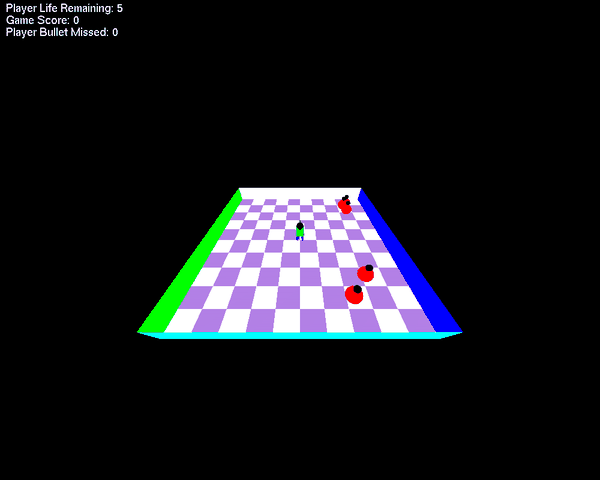

# 🔫 Bullet Frenzy 3D

<p align="center">
  
</p>

A 3D shooter set on a checkered arena. You control a gunner who moves, rotates and fires at red spherical enemies that pulse in size and chase you across the grid. The project focuses on **3D transformations**, **perspective projection** and **camera control** in OpenGL, and adds a cheat mode that spins the player and fires automatically whenever an enemy is in its line of sight.

← [Back to all projects](../)

---

## ✨ Features

- 🧍 **Player model** built from primitives: cylinder legs and arms, a cube body, a sphere head and a cylinder gun
- 🟪 **Checkered arena** generated in a loop (not hard-coded), with four coloured boundary walls
- 🔴 **5 enemies** made of two spheres that **pulse** in size and move toward the player
- 🔫 **Shooting** with a cooldown; bullets travel in the direction the gun faces
- ❤️ **Game rules**: 5 lives — an enemy touching you costs a life; the game ends at 0 lives or after **10 missed bullets**
- 🎥 **Two cameras**: an orbiting third-person camera and a first-person camera behind the gun
- 🤖 **Cheat mode**: the player rotates 360° and fires automatically when an enemy lines up
- 🧾 **HUD** with lives, score and missed bullets, and a game-over screen

## 🎮 Controls

| Input | Action |
|-------|--------|
| `W` / `S` | Move forward / backward |
| `A` / `D` | Rotate the player left / right |
| 🖱️ Left click | Fire a bullet |
| 🖱️ Right click | Toggle first-person / third-person camera |
| `↑` / `↓` | Move the third-person camera closer / farther and lower / higher |
| `←` / `→` | Orbit the third-person camera around the arena |
| `C` | Toggle cheat mode (auto-rotate and auto-fire) |
| `V` | In first person with cheat mode on: let the camera follow the spinning gun |
| `R` | Restart the game |

---

## 🧠 How it works

| Part | Implementation |
|------|----------------|
| Projection | `gluPerspective(fovY, aspect, near, far)` defines the view frustum |
| Cameras | `gluLookAt` — the third-person camera orbits using `sin`/`cos` of an angle; the first-person eye sits at the player's head looking along the gun |
| Player model | Nested `glPushMatrix` / `glTranslatef` / `glRotatef` / `glPopMatrix` calls place each body part relative to the player |
| Enemy pulse | `scale = 1 + 0.5·sin(t)` is applied to both enemy spheres every frame |
| Enemy AI | Each enemy moves along the normalised vector toward the player, scaled by delta time |
| Bullets | Spawn at the gun tip (rotated offset) and travel along `(cos θ, sin θ)` of the player's facing angle |
| Hits | Distance test between a bullet and an enemy; a destroyed enemy respawns elsewhere |
| Cheat mode | Rotate a little each frame; when the angle to an enemy is within 2°, fire |

> All rendering uses only the OpenGL functions allowed by the lab template (no lighting, no timers).

## ▶️ Run

```bash
python bullet_frenzy.py
```
