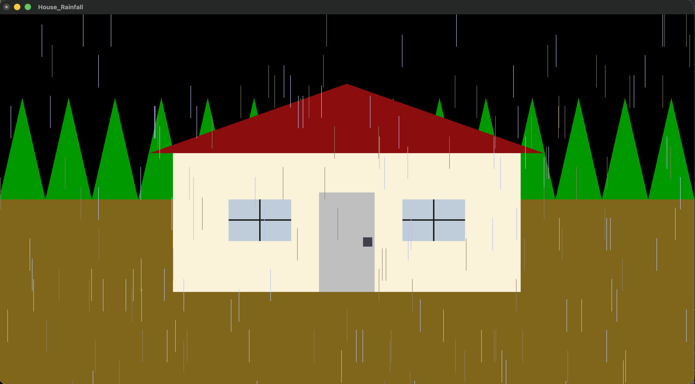
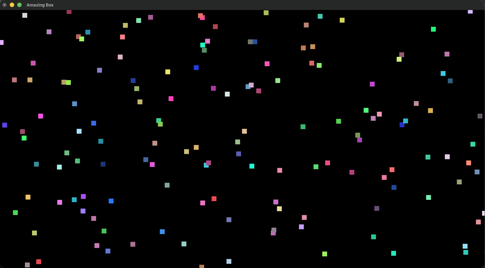

# Interactive 2D Graphics

This directory contains a collection of interactive 2D graphics applications developed using **Python**, **PyOpenGL**, **OpenGL**, and **GLUT**. These projects demonstrate concepts such as animation, user interaction, particle systems, and real-time rendering.

---

## Projects

### 1. House in Rainfall

An interactive 2D environment featuring:

- Animated rainfall
- Adjustable rain direction
- Day and night transition
- Keyboard-based interaction
- Real-time scene updates

---

### 2. Amazing Box

An interactive particle simulation featuring:

- Random particle generation
- Random particle movement
- Boundary collision detection
- Adjustable movement speed
- Blinking particle effect
- Freeze/Resume functionality
- Interactive mouse and keyboard controls

---

## Features

- Interactive keyboard and mouse controls
- Real-time animation using OpenGL
- Event-driven rendering
- Smooth frame updates
- Modular project structure

---

## Technologies Used

## Technologies Used

### Language
- Python

### Graphics Libraries
- OpenGL
- PyOpenGL
- GLUT
- GLU

### Python Standard Libraries
- random
- threading

---

## Controls

### House in Rainfall

- **Left / Right Arrow** – Change rain direction
- **Up Arrow** – Switch to Day mode
- **Down Arrow** – Switch to Night mode

### Amazing Box

- **Left Mouse Button** – Create a new particle
- **Right Mouse Button** – Toggle particle blinking
- **Spacebar** – Freeze / Resume the simulation
- **Up / Down Arrow** – Increase / Decrease particle speed

---

## Demonstrations

### House in Rainfall

#### Preview

<p align="center">
  
</p>

#### Demo Video

🎥 [Watch Demo](media/house_rainfall_demo.mp4)

---

### Amazing Box

#### Preview

<p align="center">
  
</p>

#### Demo Video

🎥 [Watch Demo](media/amazing_box_demo.mp4)
---

## Project Structure

```
Interactive-2D-Graphics/
├── House_Rainfall.py
├── Amazing_Box.py
├── media/
│   ├── house_rainfall_demo.mp4
│   └── amazing_box_demo.mp4
└── README.md
```
