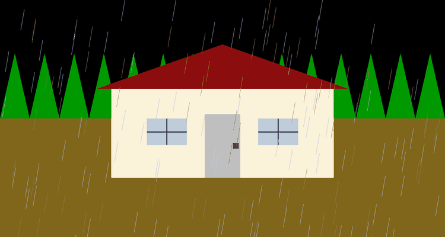
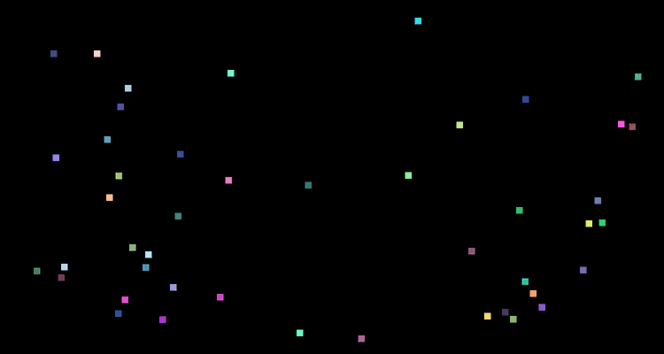
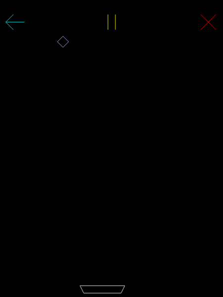
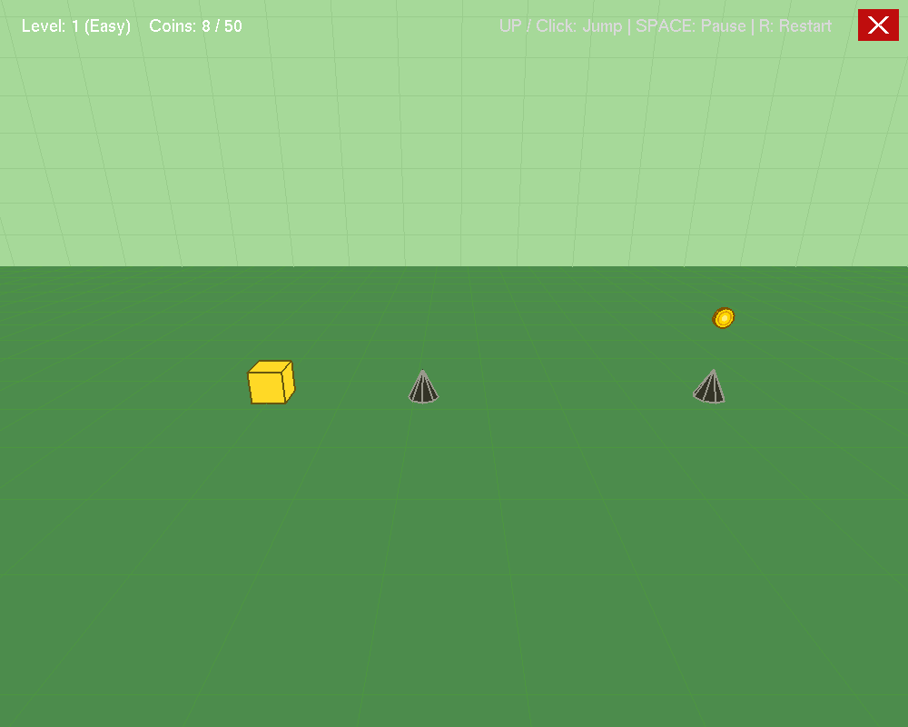

<p align="center">
  
</p>

<p align="center">
  
  
  
  
</p>

<p align="center">
  A collection of interactive graphics animations and games built from scratch with <b>Python</b>, <b>PyOpenGL</b> and <b>GLUT</b>,
  progressing from pixel-level 2D rendering to real-time 3D worlds.<br>
</p>

<p align="center">
  <a href="#-projects">Projects</a> •
  <a href="#-concepts-covered">Concepts</a> •
  <a href="#-getting-started">Getting Started</a> •
  <a href="#-repository-structure">Structure</a> •
  <a href="#-author">Author</a>
</p>

---

## 🎮 Projects

<table>
  <tr>
    <td width="50%" align="center">
      <a href="01-interactive-2d-graphics/house-in-rainfall">
        
      </a>
      <br><b>01 · House in Rainfall</b><br>
      <sub>2D scene with animated, steerable rain and a day–night cycle</sub>
    </td>
    <td width="50%" align="center">
      <a href="01-interactive-2d-graphics/amazing-box">
        
      </a>
      <br><b>01 · Amazing Box</b><br>
      <sub>Bouncing particle simulation with speed, blink and freeze controls</sub>
    </td>
  </tr>
  <tr>
    <td width="50%" align="center">
      <a href="02-catch-the-diamonds">
        
      </a>
      <br><b>02 · Catch the Diamonds</b><br>
      <sub>Arcade game drawn entirely with the Midpoint Line Algorithm</sub>
    </td>
    <td width="50%" align="center">
      <a href="03-bullet-frenzy-3d">
        
      </a>
      <br><b>03 · Bullet Frenzy 3D</b><br>
      <sub>3D shooter with perspective cameras, enemies and auto-aim cheat mode</sub>
    </td>
  </tr>
</table>

### ✨ Featured Project

<table>
  <tr>
    <td width="45%" align="center">
      <a href="https://github.com/k-a-tha/Block-Horizon-War-3D"></a>
    </td>
    <td width="55%">
      <h3><a href="https://github.com/k-a-tha/Block-Horizon-War-3D">Block Horizon War 3D</a> ↗</h3>
      An endless 3D runner with procedurally generated tracks, 5 levels with their own speeds and colour themes,
      shield power-ups, full-screen mode, background music and precise rotated-hitbox collision (Separating Axis Theorem).
      <br><br>
      <a href="https://github.com/k-a-tha/Block-Horizon-War-3D"><b>→ View the full project in its own repository</b></a>
    </td>
  </tr>
</table>

| # | Project | Type | Highlights |
|:-:|---------|:----:|------------|
| 01 | [**House in Rainfall**](01-interactive-2d-graphics/house-in-rainfall) | 2D | `GL_POINTS` / `GL_LINES` / `GL_TRIANGLES` only · rain bending · day ↔ night |
| 01 | [**Amazing Box**](01-interactive-2d-graphics/amazing-box) | 2D | Random diagonal particles · wall bouncing · blink · freeze |
| 02 | [**Catch the Diamonds**](02-catch-the-diamonds) | 2D game | Midpoint line algorithm · 8-zone symmetry · AABB collision · delta time |
| 03 | [**Bullet Frenzy 3D**](03-bullet-frenzy-3d) | 3D game | Transformations · `gluPerspective` · third- & first-person cameras · cheat mode |

---

## 🧠 Concepts Covered

| Concept | 01 Rainfall | 01 Box | 02 Diamonds | 03 Bullet Frenzy |
|---------|:-:|:-:|:-:|:-:|
| Primitive rendering (points, lines, triangles, quads) | ✅ | ✅ | ✅ | ✅ |
| Orthographic projection | ✅ | ✅ | ✅ | |
| Rasterization — Midpoint Line Algorithm & 8-way symmetry | | | ✅ | |
| 3D transformations (translate · rotate · scale) | | | | ✅ |
| Perspective projection & camera (`gluLookAt`) | | | | ✅ |
| Hierarchical modelling (`glPushMatrix` / `glPopMatrix`) | | | | ✅ |
| Animation loop & delta-time movement | ✅ | ✅ | ✅ | ✅ |
| Keyboard & mouse interaction | ✅ | ✅ | ✅ | ✅ |
| Collision detection | | ✅ | ✅ | ✅ |
| Game states (play · pause · game over · restart) | | ✅ | ✅ | ✅ |

---

## 🚀 Getting Started

### 1. Clone the repository

```bash
git clone https://github.com/k-a-tha/CSE423-Computer-Graphics-BRACU.git
cd CSE423-Computer-Graphics-BRACU
```

### 2. Install the dependencies

```bash
pip install -r requirements.txt
```

<details>
<summary><b>GLUT not found? Platform notes</b></summary>

<br>

| Platform | What to do |
|----------|------------|
| **Windows** | If you see `NullFunctionError` / `glutInit` errors, install a PyOpenGL wheel that bundles freeglut, or place `freeglut.dll` next to the script. |
| **macOS** | GLUT ships with the system — `pip install PyOpenGL` is enough. |
| **Linux** | `sudo apt install freeglut3-dev` (Debian/Ubuntu) or the equivalent for your distro. |

</details>

### 3. Run any project

```bash
python 01-interactive-2d-graphics/house-in-rainfall/house_rainfall.py
python 01-interactive-2d-graphics/amazing-box/amazing_box.py
python 02-catch-the-diamonds/catch_the_diamonds.py
python 03-bullet-frenzy-3d/bullet_frenzy.py
```

Each project folder has its own README with the full controls and the assignment question file, features and implementation notes.

---

## 📁 Repository Structure

```text
CSE423-Computer-Graphics-BRACU/
├── 01-interactive-2d-graphics/
│   ├── house-in-rainfall/
│   │   ├── house_rainfall.py
│   │   ├── media/
│   │   └── README.md
│   ├── amazing-box/
│   │   ├── amazing_box.py
│   │   ├── media/
│   │   └── README.md
│   ├── LAB_01.png 
|   └── README.md
├── 02-catch-the-diamonds/
│   ├── catch_the_diamonds.py
│   ├── media/
|   ├── LAB_02.pdf
│   └── README.md
├── 03-bullet-frenzy-3d/
│   ├── bullet_frenzy.py
│   ├── media/
|   ├── LAB_03.pdf
│   └── README.md
├── assets/
│   ├── banner.svg
│   └── block_horizon_war_3d_preview.png
├── requirements.txt
├── LICENSE
└── README.md
```

---

## 🛠️ Tech Stack

| | |
|---|---|
| **Language** | Python 3 |
| **Graphics** | OpenGL (fixed-function pipeline) via PyOpenGL · GLU · GLUT (freeglut) |
| **Standard library** | `math` · `random` · `time` · `threading` |

---

## 👤 Author

**Ridita Katha** · [@k-a-tha](https://github.com/k-a-tha)

Built as for coursework for **CSE423: Computer Graphics**, Department of Computer Science and Engineering, **BRAC University**.

## 📄 License

Released under the [MIT License](LICENSE).
